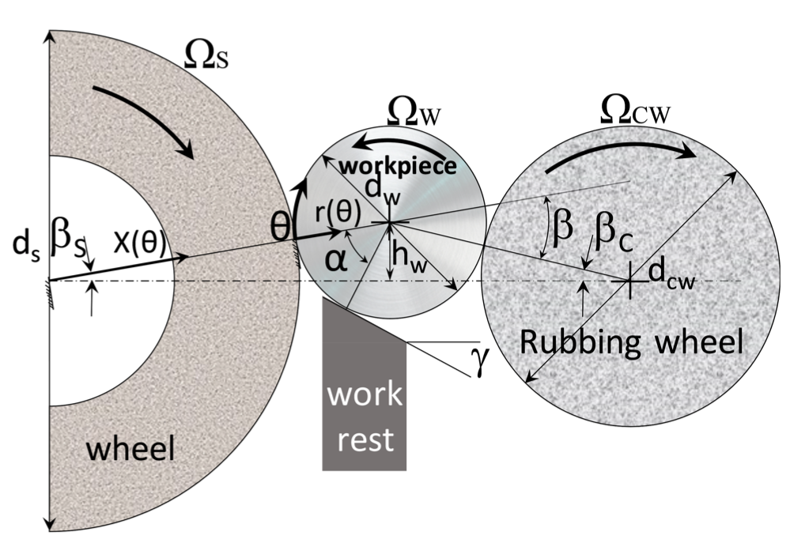

# Roundness prediction for a centerless grinding process
The manufacturing landscape has been fundamentally transformed by Industry 4.0, revolutionizing how companies produce, enhance, and distribute their products. In today's competitive environment, where resource optimization is paramount, the integration of automation and data analytics has become essential for manufacturers. Artificial Intelligence and Machine Learning have emerged as pivotal technologies in this new era, bridging the physical and digital realms of manufacturing.
As global competition intensifies, manufacturers face mounting pressure to optimize their production processes. The ability to rapidly and automatically select optimal machine parameters during setup has become crucial for meeting escalating demands for high-quality products while minimizing resource consumption.

## Problem definition
Centerless grinding presents a unique challenge in modern manufacturing due to the inherent difficulty in predicting machined part quality based on process parameters. Unlike conventional grinding processes, centerless grinding operates without fixed workpiece positioning, introducing multiple sources of variability including vibrations and positioning inconsistencies. This fundamental characteristic makes quality prediction particularly complex.
The roundness of the worked piece — a critical quality indicator — is highly sensitive to machining parameters. Traditional trial-and-error approaches to parameter selection are increasingly inadequate in meeting modern manufacturing demands for efficiency and consistency. This creates a clear need for a more sophisticated approach to parameter optimization.
To address this challenge, this project aims to develop a regression model capable of predicting workpiece roundness based on input parameters. Such a model would serve as a fundamental tool for:

* Optimizing process parameters before machining
* Reducing setup time and material waste
* Ensuring consistent quality across production runs
* Supporting data-driven decision making in manufacturing operations

By leveraging machine learning techniques, we seek to transform the complex relationship between process parameters and workpiece roundness into a predictive model that can guide parameter selection and optimization.

## Centerless grinding process
Centerless grinding is distinguished by its unique workpiece support mechanism, which relies on a three-point contact system. This system comprises two wheels—the grinding and control wheels—and a supporting blade (work rest). This configuration allows for continuous processing without the need for individual workpiece fixturing, enabling higher production rates compared to conventional grinding methods.

	

### Process parameters
The grinding operation is governed by twelve key process parameters that directly influence the final workpiece quality:

Geometric parameters
* work piece height ($h_w$)
* workpiece length
* workpiece diameter
* grinding wheel diameter
* control wheel diameter

Kinematic parameters
* blade angle ($\gamma$)
* feed velocity
* control wheel velocity

Process-material interaction parameters
* total diameter removal
* grinding specific energy
* edge force component
* grit stiffness

### Machine characteristics
Beyond the variable process parameters, nine machine-specific parameters remain constant throughout this study:
* Grinding wheel velocity
* number of workpiece elements
* initial workpiece profile distribution
* grit diameter
* abrasive/bond ratio
* dynamic system parameters:
    * mass matrix
    * stiffness matrix
    * damping matrix
    * mode shape vector

### Data generation approach
To investigate the relationship between process parameters and workpiece quality, a high-fidelity mathematical model was employed. This model, detailed in the work of Cui et al. (2014), captures the complex physics of the centerless grinding process. The model was used to generate a comprehensive dataset for this project, with the ultimate goal of developing a regression model capable of predicting workpiece roundness based on the twelve process parameters.
The use of a high-fidelity model for data generation ensures consistent and physically valid data points while allowing exploration of a wide range of operating conditions that might be impractical or costly to test in a physical setup.

Ecco un paragrafo da aggiungere al README per spiegare l'ordine in cui leggere il codice:  

---

## Code structure and reading order  
To facilitate understanding and navigation, the code is organized into sequential steps that reflect the standard machine learning workflow. Readers are encouraged to follow the notebooks in the following order:  

1. **Data inspection and visualization** – This initial step explores the dataset, providing statistical summaries and visualizations to understand key distributions, correlations, and potential anomalies in the data.  
2. **Data preprocessing** – This phase covers data cleaning, handling of missing values (if any), feature selection, and transformations required to prepare the dataset for modeling.  
3. **Modeling phase** – Here, multiple regression models are trained and evaluated to determine the most effective approach for predicting workpiece roundness.  
   - **Modeling pipeline** – The modeling workflow is structured using Scikit-Learn pipelines to ensure a reproducible and modular implementation, integrating preprocessing steps and model training into a single framework.  
4. **Hyperparameter optimization** *(work in progress)* – Ongoing efforts focus on fine-tuning the top-performing models to enhance predictive performance and generalization capabilities.  

By following this structure, users can progressively build an understanding of the dataset, the preprocessing techniques applied, and the modeling choices made throughout the project.
